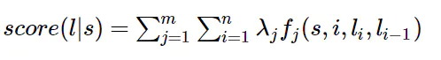

# 5分钟NLP 词法分析- 命名实体识别

[toc]

### 1、简介

#### 1.1 NER 研究的实体：

​        3大类：实体，时间，数字3类
​        7小类：人名，地名，机构名、时间、日期、货币、百分比

数量、时间、日期、货币、百分比 ： 正则模式匹配即可

人名-地名-机构名是主要研究对象

#### 1.2 中文命名实体识别难点：

a、大多数人名为未登录词
b、人名 规则构成各异【中文-日文】
c、机构名组成复杂
d、嵌套，长度

#### 1.3 基本方法

1、基于规则： 带权重规则+词典
2、基于统计: 与分词类似，隐马尔科夫，最大熵，条件随机场
3、混合方法：结合规则和统计方法。


### 2、条件随机场方法

#### 

**条件随机场**是条件概率分布模型 P(Y|X) ，表示的是给定一组输入随机变量 X 的条件下另**一组输出**随机变量 Y 的马尔可夫随机场，条件随机场可被看作是最大熵马尔可夫模型在标注问题上的推广。

```html
通俗解释: 
假设我们有Bob一天从早到晚的一系列照片，Bob想考考我们，要我们猜这一系列的每张照片对应的活动，比如: 工作的照片，吃饭的照片，唱歌的照片等等。一个比较直观的办法就是，我们找到Bob之前的日常生活的一系列照片，然后找Bob问清楚这些照片代表的活动标记，这样我们就可以用监督学习的方法来训练一个分类模型，比如逻辑回归，接着用模型去预测这一天的每张照片最可能的活动标记。这种办法虽然是可行的，但是却忽略了一个重要的问题，就是这些照片之间的顺序其实是有很大的时间顺序关系的，而用上面的方法则会忽略这种关系。比如我们现在看到了一张Bob闭着嘴的照片，那么这张照片我们怎么标记Bob的活动呢？比较难去打标记。但是如果我们有Bob在这一张照片前一点点时间的照片的话，那么这张照片就好标记了。如果在时间序列上前一张的照片里Bob在吃饭，那么这张闭嘴的照片很有可能是在吃饭咀嚼。而如果在时间序列上前一张的照片里Bob在唱歌，那么这张闭嘴的照片很有可能是在唱歌。
```


### 3、 NER 条件随机场建模  

首先要定义一个特征函数集，例如，每个特征函数都以整个句子s，当前位置i，位置i和i-1的标签为输入。然后为每一个特征函数赋予一个权重，然后针对每一个标注序列l，对所有的特征函数加权求和，必要的话，可以把求和的值转化为一个概率值。


#### 3.1、定义命名实体标记

 B M E S O 

例如：ns 得到地名例如 [香港ns 特别a 行政区n] 得到香港特别行政区 标记为BMMMMME ,

非地名的为O

#### 3.2、抽取特征

通过定义一个特征函数集合 ，  U04:%x[-2,0]

人   B
民   M
网   E 
如果遍历到当前行为“网  E”：
If(y== 'E' && x  == '人' ) return 1 else return 0;


```ruby
定义特征函数集合
#Unigram
U00:%x[-1,0]   取上一个字符
U01:%x[0,0]    取当前字符
U02:%x[1,0]    取下一字符
U03:%x[2,0]
U04:%x[-2,0]
U05:%x[1,0]/%x[2,0] 
U06:%x[0,0]/%x[-1,0]/%x[-2,0]
U07:%x[0,0]/%x[1,0]/%x[2,0]
U08:%x[-1,0]/%x[0,0]
U09:%x[0,0]/%x[1,0]
U10:%x[-1,0]/%x[1,0]

#Bigram
B

假如输入序列长度为N，那么一个Unigram模版将会产生N∗L个特征函数  

Unigram  特征函数举例

举例:U00:%x[-2,0],    行-2代表是当前行向前偏移2个位置,  0代表第2列，

有序列
人   B
民   M
网   E 
如果遍历到当前行为“网  E”：
If(y== 'E' && x  == '人' ) return 1 else return 0;

U00:%x[-1,0] 特征函数，将产生：  If(y == 'E' && x == '民') return 1 else return 0;
每个特征函数会有一个权重，这个权重是训练出来的。
在crf++中如果bigram只给出一个B，代表特征函数中不包括x这个特征，
产生特征函数如下： 
   If(y1==’M’&&y2==’E’) return 1 else return 0;
B02:%X[-1,0]%X[0,0]   
If(y1=='M'&&y2=='E'&&x2='网'&&x1='民') return 1 else return 0;
```


一系列的特征函数对序列的每个节点进行评分求和得到

，

最后指数化，标准化和归一化就可以得到当前序列的概率大小。  


模型的建立 就是通过学习，得到权重矩阵。


#### 3.3、训练过程

下面参考：   crf++ 源码解读  https://blog.csdn.net/aws3217150/article/details/69212445   

​                      CRF(条件随机场)与Viterbi(维特比)算法原理详解  https://blog.csdn.net/qq_42189083/article/details/89350890 

第一步，把输入序列 应用特征函数转换为如下结构：


第二步:  训练序列构成网络图：


获得模型总的目标值，梯度，然后交由给L-BFGS进行优化参数就完成了参数更新任务，然后重复迭代这个过程，直到收敛。

第三步：Forward 按路径计算alpha,beta 值

第四步：计算梯度和目标值


#### 3.4、 训练过程解释

#### 


这里每个节点，都表示前面的所有路径到当前节点路径的所有得分之和。所以，最后的s[4][6]即为最终的得分之和，即：

 

然后就是重复上述的求解所有路径的过程，将总和和实际的标注的得分都求出来，得到loss，然后进行更新T，emit即可。


#### 3.5 识别过程


### 4、条件随机场和其他方法比较

##### 逻辑回归

条件随机场是逻辑回归的序列化版本。逻辑回归是用于分类的对数线性模型，条件随机场是用于序列化标注的对数线性模型。

##### HMM 

对于词性标注问题，HMM模型也可以解决。HMM的思路是用生成办法，就是说，在已知要标注的句子s的情况下，去判断生成标注序列l的概率，如下所示：


p(l_i|l_i-1)是转移概率，比如，l_i-1是介词，l_i是名词，此时的p表示介词后面的词是名词的概率。
 p(w_i|l_i)表示发射概率（emission probability），比如l_i是名词，w_i是单词“ball”，此时的p表示在是名词的状态下，是单词“ball”的概率。

**每一个HMM模型都等价于某个CRF**

但是，CRF要比HMM更加强大，原因主要有两点：

- **CRF可以定义数量更多，种类更丰富的特征函数**。
- **CRF可以使用任意的权重** 将对数HMM模型看做CRF时，特征函数的权重由于是log形式的概率，所以都是小于等于0的，而且概率还要满足相应的限制，如