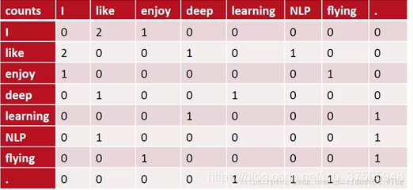
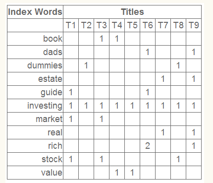
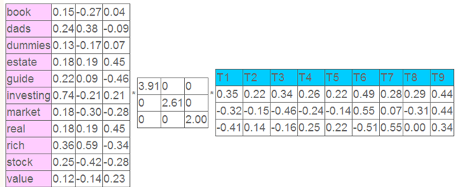
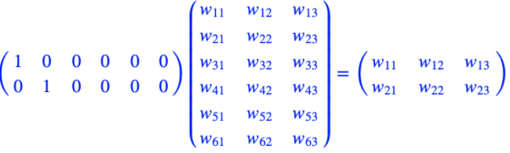

# 五分钟NLP - 文本向量化-词向量-句向量

## 一、基于统计方法

#### 1.1 词袋模型 one-hot 法

 也叫 bag-of-word 词袋模型  one-hot 算法 , 一句一个袋子，每个词一个颜色 ； N维中的1维 为1个词

```c
例如文本
[John like to watch movies,Mary likes too] 
[John also likes to watch football game ]
词向量为：
John  [1,0,0,0,0,0,0,0,0,0]  维数为词个数    

这两句向量化结果：===>            
 [1,2,1,1,1,0,0,0,1,1]    
 [1,1,1,1,0,1,1,1,0,0]
```

#### 1.2、 共现矩阵

通过统计一个事先指定大小的窗口内的word共现次数，以word周边的共现词的次数做为当前word的vector。
得到的是一个NxN 的矩阵。




#### 1.3、共现矩阵的SVD降维

对共现矩阵X做矩阵分解（如奇异值分解）得到矩阵正交矩阵U，对U进行归一化得到一个稠密的连续词向量矩阵，即视为所有词的词向量。




## 二、深度学习方法

#### 2.1 神经网络语言模型NNLM

    NNLM模型基本思想：
    上下文相似的词，其语义也相似，利用上下文分布表示词义；
    假定词表中的每一个word都对应着一个连续的特征向量；
    假定一个连续平滑的概率模型，输入一段词向量的序列，可以输出这段序列的联合概率；
    同时学习词向量的权重和Ngram概率模型里的参数。
##### 模型

采用了一个简单的前向反馈神经网络f(wt−n+1,...,wt)来拟合一个词序列的条件概率p(wt|w1,w2,...,wt−1)。

第一层为映射层，第二层为隐藏层，第三层为输出层见下图：


   [1]词库大小(假定有1300个词)       

   [2]转化的词向量大小(假定为30维长度)       

   [3]映射层神经元数(即词的滑动窗口容量，假定滑窗大小为10)       

   [4]隐藏层神经元数量(假定为10个)       

   [5]输出层神经元数(对应词容量，有1300个)  对应原始词向量

   [6]由输入层到投影层的矩阵C（一个大的矩阵，大小为1300*30,开始时随机初始化）      

##### 映射层 - 词汇表达+特征降维

输入W:   N−1个one-hot词向量 : 假定 [  10-1 , 1300维]，

**共享矩阵：C = [词典大小，词向量维度m]   假定1300, 30   , 这也是我们需要训练的词向量矩阵。**

输出： WxC = [10-1 ,  30 ] =[9,30 ]



例如 "我" "爱" "北京" 来预测 "天安门"先得到 前3个词的向量

##### 隐藏层

输入：映射层输出向量拼接为1维向量x 例如：   [9,30 ] => [ 1, 270]

计算：对 x 的每个元素做加权求和，加上偏移后作为神经元激活函数tanh输入,  tanh(d + H * x) 

​               其中 x 是合并后词向量, H 是连接隐含层神经元权重矩阵, d是连接神经元偏移值矩阵;

输出：经过tanh函数的激活


##### 输出层：

输入： 隐藏层输出的向量y,  例如 [1，10]

输出：softmax (b + W * x + U * y)      [1, 	1300]

```
softmax用于多分类过程中，它将多个神经元的输出，映射到（0,1）区间内，可以看成概率来理解，从而来进行多分类！
```


##### 损失： 用原始向量 - 得到的输出 

```
cost = tf.reduce_mean(tf.nn.softmax_cross_entropy_with_logits_v2(logits=model, labels=Y))
```

算法实现参阅：https://www.cnblogs.com/Luckidmi/p/11208727.html

缺点：定长，参数空间大

#### 2.2 word2vec 

###### 2.2.1  CBOW 模型


思路就是：输入中间词前后共C个词，预测中间词，在这个过程中训练出我们需要的词向量矩阵。

和NNLM 区别在于：
1、将 one-hot 向量输入存放词向量的矩阵 WV×N进行查表，V为词表的大小，N为词向量的维度
2、隐藏层：把输入直接相加变为 ， 例：[9,30 ]   => [1,30] 

3、输出层：

通过一个N×V的矩阵映射到输出层，例： 30 ,1300  =>  [1, 1300]   

然后通过 softmax激活函数处理得到V-dim概率分布 {PS: 因为是onehot嘛，其中的每一维斗代表着一个单词}，概率最大的index所指示的单词为预测出的中间词（target word） 与true label的onehot做比较，误差越小越好

Hierarchical Softmax 

```
 
为了避免要计算所有词的softmax概率，word2vec采样了霍夫曼树[词频为权值]来代替从隐藏层到输出softmax层的映射。也叫做层次Softmax，softmax概率计算只需要沿着树形结构进行就可以了。
```

Negative Sampling 负采样

```
如果语料库非常大，即使用了哈夫曼树的话，常见的排在最前面，那么有很多不常见的排在后面，这样就会使计算复杂度变得非常大
我们希望预测对的就可能性达到最大化。累乘的意思就是所有的词都可以预测对。前者是通过霍夫曼树，现在是通过区间取值。
```


###### 2.3 Skip-Gram 

输入是特定的一个词wt的词向量，而输出是特定词对应的上下文词向量。


###### word2vec源码地址

https://code.google.com/archive/p/word2vec/ ，

https://github.com/svn2github/word2vec。


#### 2.3 GloVe算法

GloVe = SVD分解+Word2Vec

##### 思想

Glove相对于Word2Vec，需要提前统计词共现矩阵，并将其整合到代价函数之中，使得训练结果对于该统计是有一定的重建能力的。我们将其称为一种统计模型（count-based model），其目标是优化减小重建损失（reconstruction loss），即降维之后的向量能尽量表达原始向量的完整信息。

##### 过程：

1、根据语料库（corpus）构建一个共现矩阵（Co-ocurrence Matrix）（什么是共现矩阵？），矩阵中的每一个元素代表单词和上下文单词在特定大小的上下文窗口（context window）内共同出现的次数。一般而言，这个次数的最小单位是1，但是GloVe不这么认为：它根据两个单词在上下文窗口的距离，提出了一个衰减函数（decreasing weighting）：用于计算权重，也就是说距离越远的两个单词所占总计数（total count）的权重越小。

2、构建词向量（Word Vector）和共现矩阵（Co-ocurrence Matrix）之间的近似关系，论文的作者提出以下的公式可以近似地表达两者之间的关系：


## 三、句向量 wmd

##### 基本步骤：

1、利用word2vec将词编码成词向量
2、去掉停用词
3、计算出每个词在文本中所占权重，一般用词频来表示
4、对于每个词，找到另一条文本中的和自己最近的词，确定移动多少距离到这个词上。

5、用词向量距离与移动的多少相乘就是两个词的转移代价，保证全局的转移代价加和是最小的

##### 求解最小距离

单纯形法：指数级时间复杂度
内点法：多项式级时间复杂度
Fast EMD：O(p3logp)O(p3log⁡p)（其中，p代表两篇文本分词去重后词表的大小）

```
EMD距离-推土机距离
假设在位置 1 处我们分布有p1,...pn 那么多的土，简单起见我们设土的总数量为 1，即 ，现在要将土推到位置 2上，每处的量为q1,...qn ，而从 i 推到 j 的成本为 ，求成本最低的方案以及对应的最低成本。

    """通过线性规划求n距离
    A_eq = np.array(A_eq)
    b_eq = np.concatenate([p, q])
    D = D.reshape(-1)
    result = linprog(D, A_eq=A_eq[:-1], b_eq=b_eq[:-1])
    return result.fun
```


##### 优化步骤：

找出能快速计算的WMD下界用来过滤不满足下界的文本，再使用精确的WMD算法计算距离。

a. 使用文本WCD距离来对文本排序，拿到前k个文本；
b. 遍历剩余文本，基于RWMD来与目前拿到的第k个文本比较，判断是否超过第k个文本的RWMD距离。如果不超过，就去掉文本，如果超过，继续计算WMD距离比较并且更新k个文本；

##### 工程优化：

1、而是用cgo封装Fast EMD，重新实现了WMD算法，产生了惊人的性能提升。
2、不同词的重要性是不一样的，用tf-idf替换了词频。

参考：https://zhuanlan.zhihu.com/p/84809907